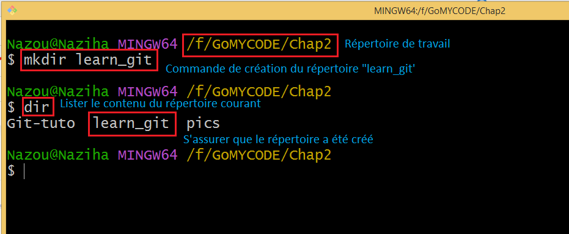
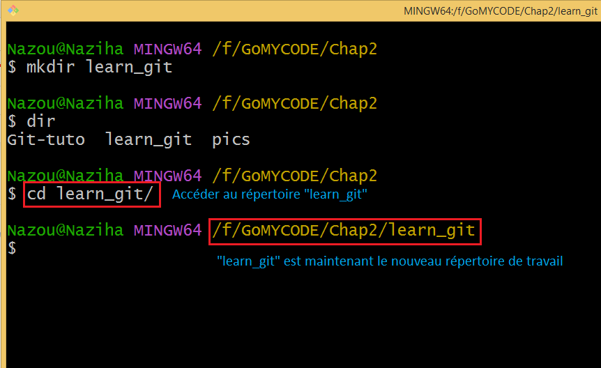
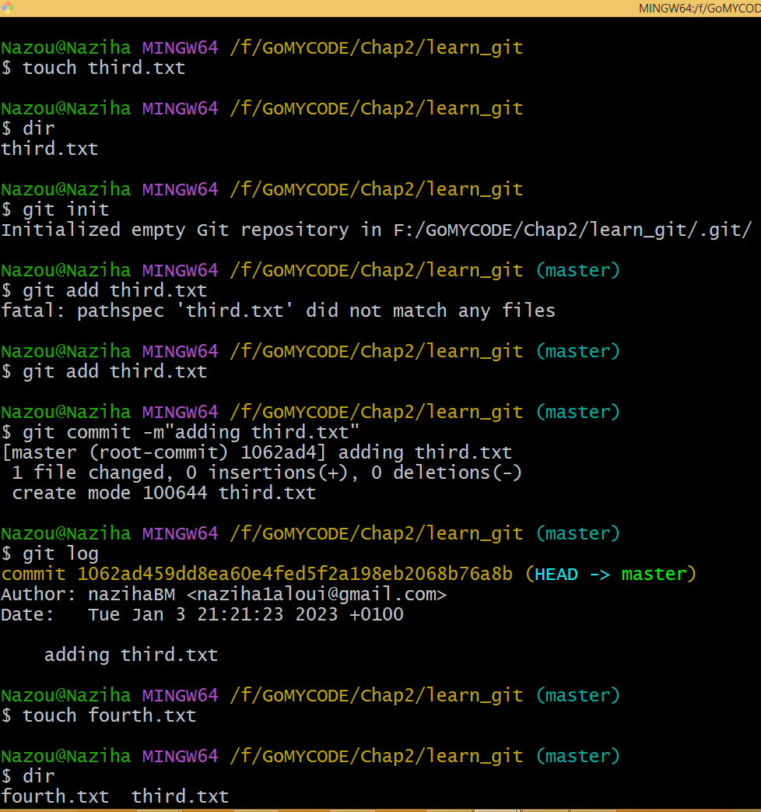
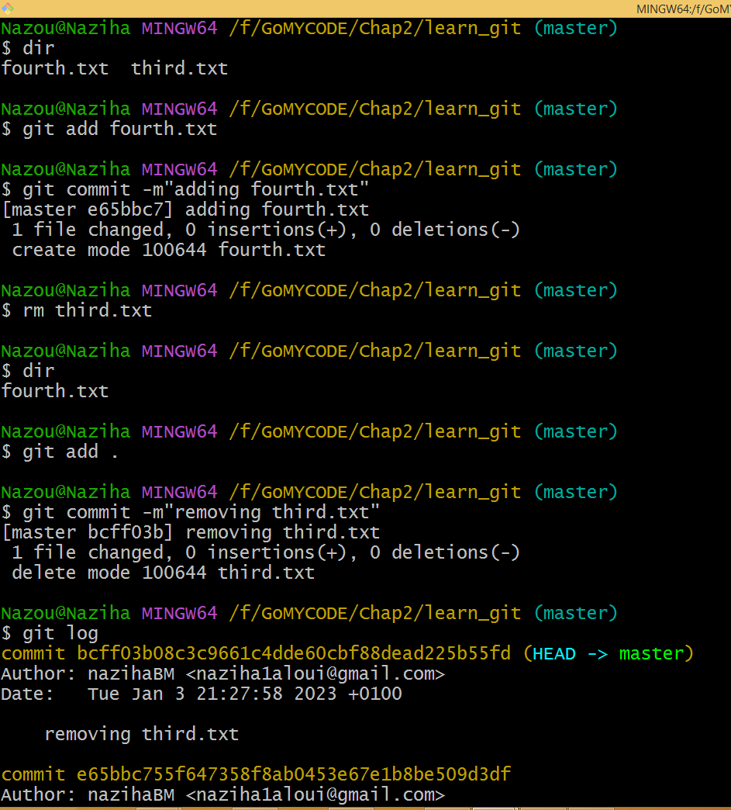
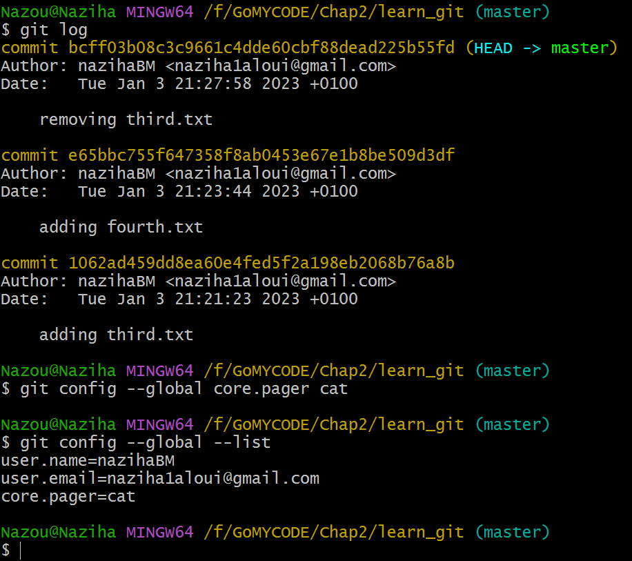

# checkpoint-chap2: learn_git 
## Rappel de l'énoncé
Rappelons le travail demandé :
1. Create a folder called learn_git.
2. Cd (change directory) into the learn_git folder.
3. Create a file called third.txt.
4. Initialize an empty git repository.
5. Add third.txt to the staging area.
6. Commit with the message "adding third.txt".
7. Check out your commit with git log.
8. Create another file called fourth.txt.
9. Add fourth.txt to the staging area.
10. Commit with the message "adding fourth.txt"
11. Remove the third.txt file.
12. Add this change to the staging area. (Using the command "git add . "
13. Commit with the message "removing third.txt".
14. Check out your commits using git log.
15. Change your global settings to core.pager=cat - you can read more about that here.
16. Write the appropriate command to list all the global configurations for git on your machine.
17. You can type git config --global to find out how to do this.

## Réalisation
Mon répertoire de travail est `F:\GoMYCODE\Chap2`. Les imprimes-écran sont enregistrés dans le répertoire `pics\`. Après avoir éditer le fichier `readme.md`, les commandes suivantes sont exécutées pour enregistrer ces dernières modifications :

- `git add .` pour ajouter tous les nouveaux fichiers (readme.md et les images).
- `git commit -m"Add pictures and readme.md file"` pour enregitrer ces fichiers.

Voici le checklist des activités demandées :
- [x] Create a folder called learn_git (`mkdir learn_git`).
- [x] Cd (change directory) into the learn_git folder (`cd learn_git`).
- [x] Create a file called third.txt (`touch third.txt`).
- [x] Initialize an empty git repository (`git init`).
- [x] Add third.txt to the staging area (`git add third.txt`).
- [x] Commit with the message "adding third.txt" (`git commit -m"adding third.txt"`).
- [x] Check out your commit with git log (`git log`).
- [x] Create another file called fourth.txt (`touch fourth.txt`).
- [x] Add fourth.txt to the staging area (`git add fourth.txt`).
- [x] Commit with the message "adding fourth.txt" (`git commit -m"adding fourth.txt"`).
- [x] Remove the third.txt file (`rm third.txt`).
- [x] Add this change to the staging area. (Using the command "git add . " (`git add .`)
- [x] Commit with the message "removing third.txt" (`git commit -m"removing third.txt"`).
- [x] Check out your commits using git log (`git log`).
- [x] Change your global settings to core.pager=cat - you can read more about that here (`git config --global core.pager cat`).
- [x] Write the appropriate command to list all the global configurations for git on your machine (`git config --global --list`).
- [x] You can type git config --global to find out how to do this.

